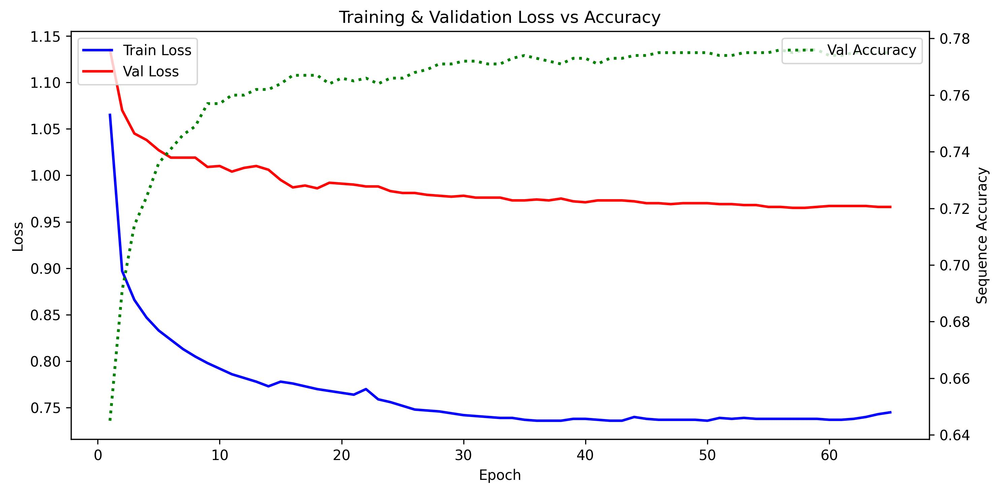
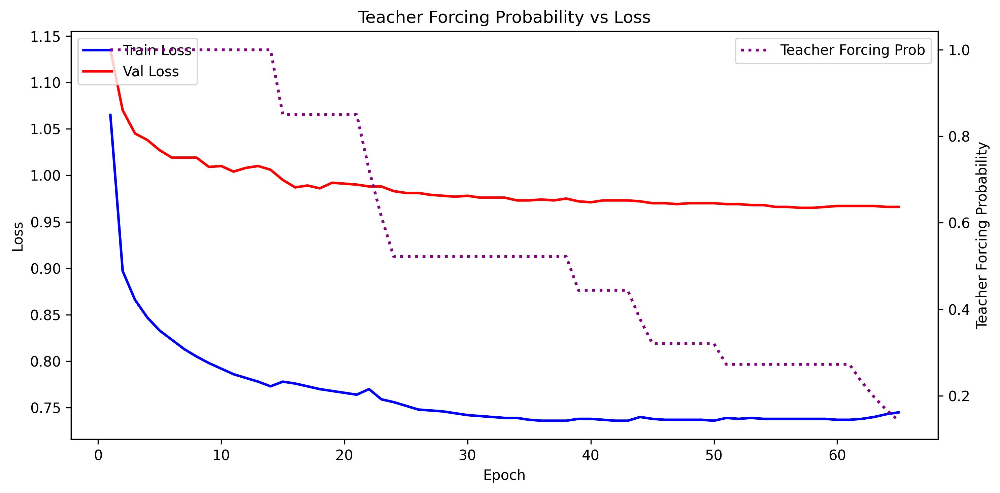

# simple-g2p
Grapheme-to-phoneme (G2P) conversion predicts phonetic pronunciations from written words, essential for text-to-speech and speech recognition systems. This project implements an LSTM encoder–decoder model trained on CMUdict that converts graphemes to phoneme sequences.

## Results

### LSTM

The encoder–decoder Bi-LSTM model uses Luong attention, scheduled sampling during training, and greedy decoding for inference. It achieves a **test sequence-level accuracy of 77%** on the CMUdict dataset.

#### Training Graphs

<table>
<tr>
<td width="50%">

**Loss vs Sequence Accuracy**: Training loss plotted against sequence-level accuracy throughout training epochs.

</td>
<td width="50%">

**Loss vs Teacher Forcing**: Training loss evolution with varying teacher forcing probabilities during scheduled sampling.

</td>
</tr>
</table>

<!-- Add results for other models here -->